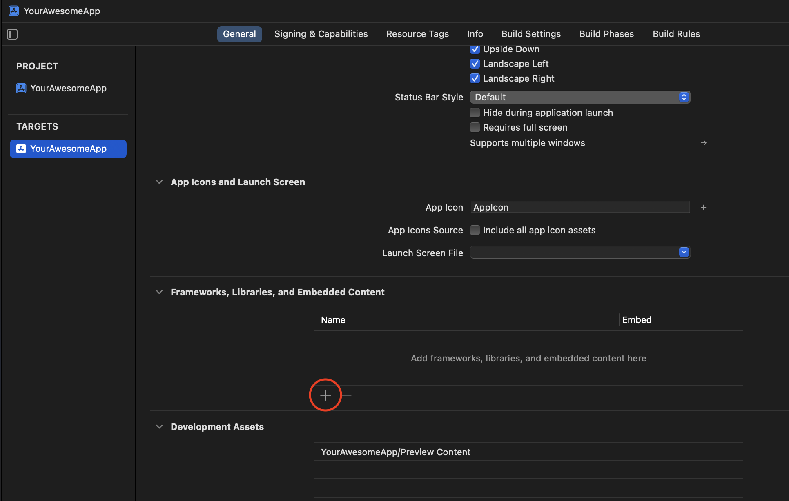
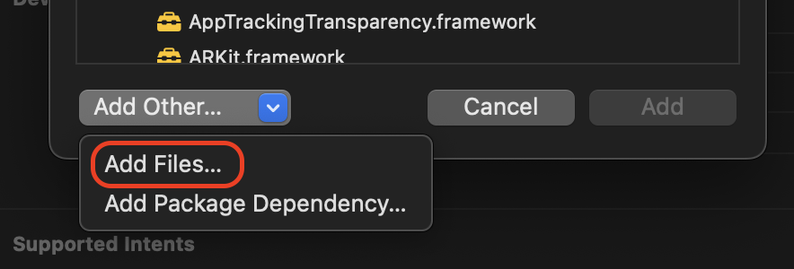

# curl-ios

Pre-compiled libcurl framework for iOS and iPadOS applications! Automatically updated within
24-hours of a new release of curl.

This copy of curl is built to use [OpenSSL](https://github.com/tls-inspector/openssl-ios), which
uses the root certificates from [rootca](https://github.com/tls-inspector/rootca).

## Using the pre-compiled framework

1. Download and extract the xcframework.zip from the latest release.
   
   If you are planning on using Curl in Swift, use `curl_swift.xcframework.zip`, otherwise use `curl.xcframework.zip`.

1. _(Optional but recommended)_ download the [signing key](signingkey.pem) and the .sig file for your downloaded zip from the release and verify the signature using OpenSSL
    ```bash
    openssl dgst -sha256 -verify signingkey.pem -signature curl.xcframework.zip.sig curl.xcframework.zip
    ```

1. Select your target in Xcode and click the "+" under Frameworks, Libraries, and Embedded Content  
    
1. Click "Add Other" then "Add Files..."  
    
1. Select the extracted `curl.xcframework` directory.

   Note that Xcode will reference the directory _in-place_, so make sure you've moved it somewhere suitable (outside your downloads directory!).

1. Use curl in your code!

   **Swift**:
   ```swift
   import Curl
   import Foundation

   let curlVersion: String = LIBCURL_VERSION
   ```

   **Objective-C**:
   ```objc
   #import <curl/curl.h>
   #import "YourAwesomeClass.h"

   @implementation YourAwesomeClass

   + (NSString *) curlVersion {
      return @LIBCURL_VERSION;
   }

   @end
   ```

## Compile it yourself

Use the included build script to compile a specific version or customize the configuration options.

```
./build-ios.sh [-c <curl version>] [-o <openssl version>] [-r <rootca version>] [-n <rootca bundle name>] [-vsg] [-- build args]

Options are:

-c <curl version>
   Specify the version of curl to compile. If not specified, will query the curl github repo and use
   the latest release. If not specified then the 'jq' utility must be installed.

-o <openssl version>
   Specify the version of the openssl-ios package to download and use. If not specified, will query
   the tls-inspector/openssl-ios repo and use the latest release. If not specified then the 'jq'
   utility must be installed.

-o <rootca version>
   Specify the version of the root ca bundle to download and use. If not specified, will query
   the tls-inspector/rootca repo and use the latest release. If not specified then the 'jq'
   utility must be installed.

-n <rootca bundle name>
   Specify the name of the root ca bundle to download and use. Defaults to 'apple'. Valid options
   are 'apple', 'google', 'microsoft', 'mozilla', and 'tlsinspector'.

-v
   Verify signatures of downloaded artifacts

-s
   Include a Swift module map and shim files. Do not use this if you plan to use this framework in
   an Objective-C project.

-g
   Use the 'gh' command line tool instead of curl for GitHub API queries. This is useful for when
   running this script in a Github action.

-- build args
   Any arguments after -- are passed directly to the ./configure step of compiling curl. Regardless
   of this value these parameters are always provided:
   --disable-shared --enable-static --with-openssl --without-libpsl
```

## Using Curl in Swift

This package provides support for using Curl in swift. When compiling this package you must pass `-s`.
This will create a .xcframework file that includes a modulemap so you can simply use `import Curl` in any Swift file.

### Swift Shim

This library includes a shim header to work-around some incompatibilities with curl and Swift's C interoperability. Curl
uses C macro functions that accept variables of any type and Swift does not support this.

When using `curl_easy_setopt` in Swift, you will need to use one of the provided shim functions specific to the
datatype, such as `curl_easy_setopt_string`.

## Export Compliance

This script includes OpenSSL and other cryptographic code.

Please remember that export/import and/or use of strong cryptography software, providing
cryptography hooks, or even just communicating technical details about cryptography
software is illegal in some parts of the world. By using this script, or importing the
resulting compiled framework in your country, re-distribute it from there or even just
email technical suggestions or even source patches to the authors or other people you are
strongly advised to pay close attention to any laws or regulations which apply to you.
The authors of this script, Curl, and OpenSSL are not liable for any violations you make here.
So be careful, it is your responsibility. 
